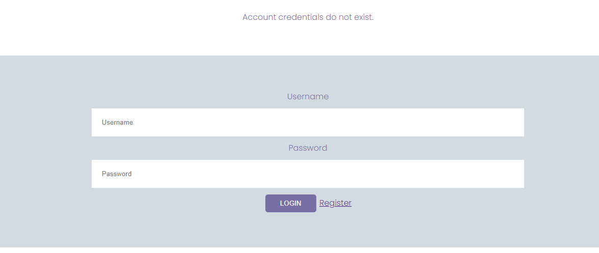

# CIMS

## Clinical Information Management System

Clinic Information Management System (CIMS) is a fullstack web application, developed using python django. It enables clinic personnel and administrators to not only track patient records but also the doctors and nurses providing health care and treatment to the respective patients.

### Application Goal

To manage patient information and enable tracking of health care services

### Target Audience

* The system administrator who might want to add new personnel in the  CIMS application

* Doctors who might want to treat patients

* Pharmacists who might want to prescribe medicine to patients

* Laboratory technicians who might want to perform tests and diagnosis

* Receptionists who might want to enter patient records and make patient appointments

------

## Features

1. **The Navigation Bar**

* The navigation bar is responsive and is included on all four pages. It provides links to the Home page, Team page, Services page and the login page. It is the same on each page to facilitate easy navigation.

* This section allows users to simply go from page to page across all devices without having to use the ‘back’ button to return to the previous page.

2. **The CIMS landing page**

* The landing or main Home page comprises an image of the services to help the viewer understand what this site is about and how it can be useful. In this case, the CIMS logo and the Home are both linked.

3. **The Footer**

* The footer section includes the copyright information of CIMS.

3. **The Team page**

* The team page on the CIMS application shows the different persons on the team at the clinic or hospital. These include the doctors, laboratory technicians, receptionists and the pharmacists.

4. **The Services page**

* The services page contains a list of services offered in the CIMS application. These services include patient record management, making appointments, laboratory record management and pharmacy stock and record management.

5. **The Login page**

* The login page for the CIMS application is where users may enter their credentials that is the username and password. The login feature is created for users who are already registered in the system. The page also contains a register link for new users to sign up on the application.

6. **Register**

* The register link helps new users to signup or create accounts in the CIMS application. The page allows new users to enter their usernames, passwords, emails as well as a field to confirm their passwords.

7.**The flash messages**

* On successful login, the user gets to view a dashboard which is different from the home page.

* When a user enters wrong credentials, that is to say either a wrong username or password, the form returns a message that reads Account credentials do not exist.

* When the user enters either a correct username or password, the system returns a flash message thst reads wrong username or password.

* Likewise, when a user wants to log out of the system. The CIMS application returns the message you have logged out, goodbye!

------

## Testing and Validation

** Pep8 Validation **

### Bugs and Fixes

## Deployment
------
### Version Control

* The site was created using the Visual Studio Code editor and pushed to github to the remote repository covid-vaccination-survey-data-analyser.

The following git commands were used throughout development to push code to the remote repo:

* git add <file> - This command was used to add the file(s) to the staging area before they are committed.

* git commit -m "commit message" - This command was used to commit changes to the local repository queue ready for the final step.

* git push - This command was used to push all committed code to the remote repository on github.

### Heroku Deployment

The following steps were followed to deploy this project to Heroku:

* Go to Heroku and click "New" to create a new app.

* Choose an app name and region region, click "Create app"

* Go to "Settings" and navigate to Config Vars. Add the following config variables:
   * PORT : 8000
* Navigate to Buildpacks and add buildpacks for Python and NodeJS (in that order).

* Navigate to "Deploy". Set the deployment method to Github and enter repository name and connect.

* Scroll down to Manual Deploy, select "main" branch and click "Deploy Branch".

* The app will now be deployed to heroku

### Cloudinary Deployment

## Credits
------
* Lecture/ course videos on how to deploy the application

* You tube tutorials on how to import library in python https://www.youtube.com/watch?v=h0oRPIlnJYQ
