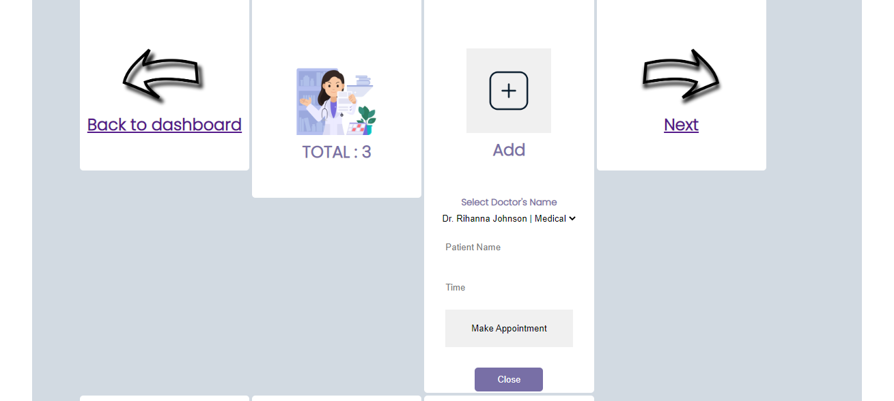
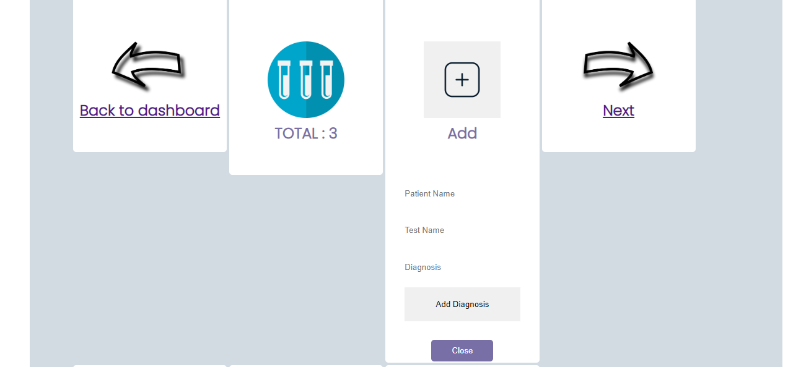

# CIMS

## Clinical Information Management System

Clinic Information Management System (CIMS) is a fullstack web application, developed using python django. It enables clinic personnel and administrators to not only track patient records but also the doctors and nurses providing health care and treatment to the respective patients.

### Application Goal

To manage patient information and enable tracking of health care services

### Target Audience

* The system administrator who might want to add new personnel in the  CIMS application

* Doctors who might want to treat patients

* Pharmacists who might want to prescribe medicine to patients

* Laboratory technicians who might want to perform tests and diagnosis

* Receptionists who might want to enter patient records and make patient appointments

------

## Features

1. **The Navigation Bar**

* The navigation bar is responsive and is included on all four pages. It provides links to the Home page, Team page, Services page and the login page. It is the same on each page to facilitate easy navigation.

* This section allows users to simply go from page to page across all devices without having to use the ‘back’ button to return to the previous page.

* In addition, the navigation bar highlights the page the user is on in white.

2. **The CIMS landing page**

* The landing or main Home page comprises an image of the services to help the viewer understand what this site is about and how it can be useful. In this case, the CIMS logo and the Home are both linked.

3. **The Footer**

* The footer section includes the copyright information of CIMS.

3. **The Team page**

* The team page on the CIMS application shows the different persons on the team at the clinic or hospital. These include the doctors, laboratory technicians, receptionists and the pharmacists.

* The team page shown below is that of an unregistered user who is just browsing the site. These users can only view the members on the team but can not perform any actions.

4. **The Services page**

* The services page contains a list of services offered in the CIMS application. These services include patient record management, making appointments, laboratory record management and pharmacy stock and record management.

* The service page below is the view for unregistered users. They can only view and read the services but can not perform any actions. One would be required to register and log in to CIMS to manage the services.

5. **The Login page**

* The login page for the CIMS application is where users may enter their credentials that is the username and password. The login feature is created for users who are already registered in the system. The page also contains a register link for new users to sign up on the application.

6. **Register**

* The register link helps new users to signup or create accounts in the CIMS application. The page allows new users to enter their usernames, passwords, emails as well as a field to confirm their passwords.

7.**The flash messages**

* On successful login, the user gets to view a dashboard which is different from the home page. This is one of the differences between the authorized and unauthroized users on the app. Only the authorized or registered users can view the CIMS dashboard.

* On successful login, the site also shows the user who is successfully logged in.

* The flash messages give the users an option to hide them through the close button.

* When a user enters wrong credentials, that is to say either a wrong username or password, the form returns a message that reads Account credentials do not exist.

* When the user enters either an incorrect username or password, the system returns a flash message that reads wrong username or password.

* Likewise, when a user wants to log out of the system. The CIMS application returns the message you have logged out, goodbye!

### The Dashboard for registered users

* The CIMS dashboard allows the users in the system not only to view but to manage the services on the application such as patients, appointments, diagnosis and medication whose data is stored in their respective custom models which are patient, appointment, diagnosis and medicine.

* The dashboard has arrows within each tab for easy navigation from service to the next and back to the dashboard. The services on the service page are also linked to the corresponding models for easy management.

1. **Manage Patients**

* As a refistered user, CIMS allows you to manage the patients. Within the patients tab, you can view, add, update and delete patients. You can also view the total number of patients within CIMS in this tab.

* The add functionality in manage patients allows users to add the full name, the ailment and diagnosis of the patient.

* The update button allows users to update the name, ailment and diagnosis fields of the patients while the delete button allows users to delete patients from the CIMS application.

2.**Manage Appointments**

* CIMS allows authorized users to manage appointments within the app. Here users can view the existing appointments, add appointments, update and delete appointments.

* The appointment model allows users to add fields like the patient name, the doctor's  or specialists name and the time of visit when making an appointment.

3.**Manage Diagnosis**

* CIMS allows users to manage diagnosis within the app. Here users can view the existing diagnosis, add, update and delete diagnosis.

* The diagnosis model allows the users to add fields like patient name, test name, diagnosis and time of visit when creating a diagnosis.

4.**Manage Medicine**

* CIMS allows authorized users to manage medicine or treatment within the app. Here users can view the existing treatments, add, update and delete prescriptions.

* The medicine module allows users to add fields like the patient to whom the medicine is prescribed to, the medication and the stock when issuing a prescription.

5.**Manage Team Members**

* CIMS app allows authorized users to view members, add, update and delete members from the app.

* CIMS provides users the functionality to add fields like the full name, position and department when adding a new member to the team in CIMS app.

------

## Testing and Validation

**Testing**

* Using Django unit testing to ensure that models within the app exist, are functioning and can be used to capture user data.

**Validation**

* Frontend validation was used to ensure that form data being submitted to our views are not empty or null.

* Serverside validation was used to ensure that the right data was being posted before capturing it to the database.

### Bugs and Fixes

* During the login phase, there was a bug that returned false message for users created that are not in the system. This bug was fixed by simply changing the message to 'credentials does not exist' in the views for the logins.

## Deployment
------
### Version Control

* The site was created using the Visual Studio Code editor and pushed to github to the remote repository django-cims.

The following git commands were used throughout development to push code to the remote repo:

* git add <file> - This command was used to add the file(s) to the staging area before they are committed.

* git commit -m "commit message" - This command was used to commit changes to the local repository queue ready for the final step.

* git push - This command was used to push all committed code to the remote repository on github.

### Heroku Deployment

The following steps were followed to deploy this project to Heroku:

* Go to Heroku and click "New" to create a new app.

* Choose an app name and region region, click "Create app"

* Go to "Settings" and navigate to Config Vars. Add the following config variables:
   * PORT : 8000
* Navigate to Buildpacks and add buildpacks for Python and NodeJS (in that order).

* Navigate to "Deploy". Set the deployment method to Github and enter repository name and connect.

* Scroll down to Manual Deploy, select "main" branch and click "Deploy Branch".

* The app will now be deployed to heroku

### Cloudinary Deployment

## Credits
------
* Lecture/ course videos on how to deploy the application

* You tube tutorials on how to import library in python https://www.youtube.com/watch?v=h0oRPIlnJYQ

* All images are from Pixabay https://pixabay.com/images/search/

* Stackover flow for fixing code bugs https://stackoverflow.com/

